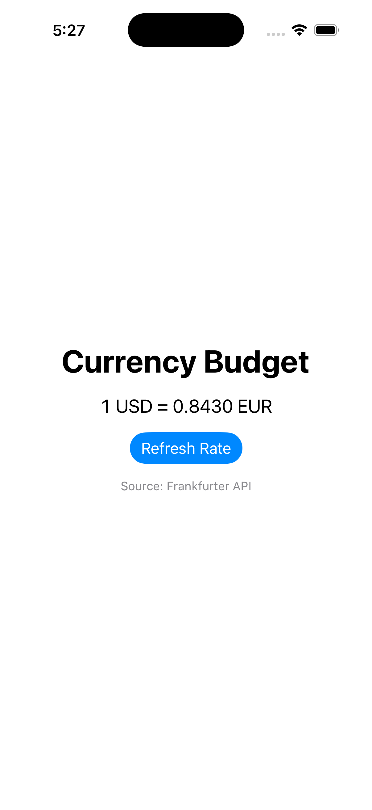

# CurrencyBudget iOS App

A simple SwiftUI iOS application that retrieves real-time currency exchange rates using the Frankfurter API and displays them in a clean, modern interface.

## Features
- Fetches live exchange rate data from an external API  
- Displays USD → EUR conversion rate  
- Built with SwiftUI and async/await networking  
- Clean, minimal user interface  
- Error-safe loading behavior  

## Tech Stack
- Language: Swift  
- Framework: SwiftUI  
- Networking: URLSession + async/await  
- API Source: Frankfurter Exchange Rate API  

## Screenshots

  

## What I Learned
- How to build a SwiftUI layout from scratch  
- Making asynchronous API calls in Swift  
- Handling loading states and updating UI dynamically  
- Connecting an Xcode project to GitHub using Git  

## Future Improvements
- Support multiple currencies  
- Add input for custom amounts  
- Improve UI styling and animations  
- Add offline caching  

## Author
Created by Zora Smith 
